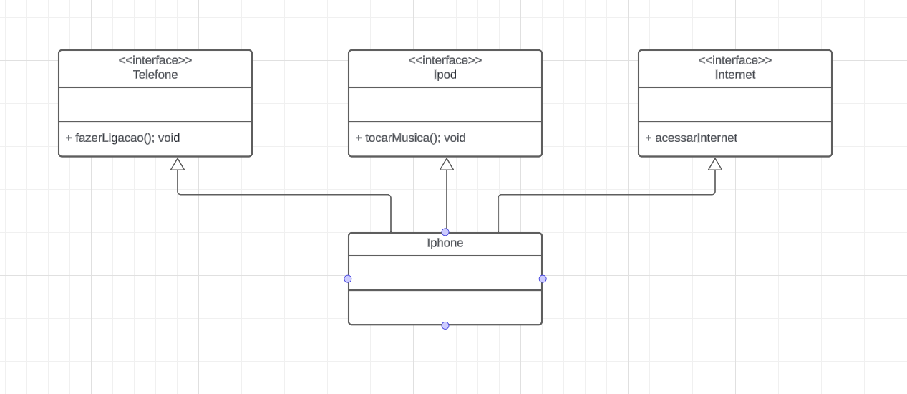

## Desafio Iphone Santander
Desafio do bootcamp java santander onde através dos pilares da orientação objeto e interfaces, seja possível criar iphones capaz de ligar, receber ligação, tocar musica e acessar a internet.

## UML
O Projeto tomou como base o diagrama UML abaixo.

